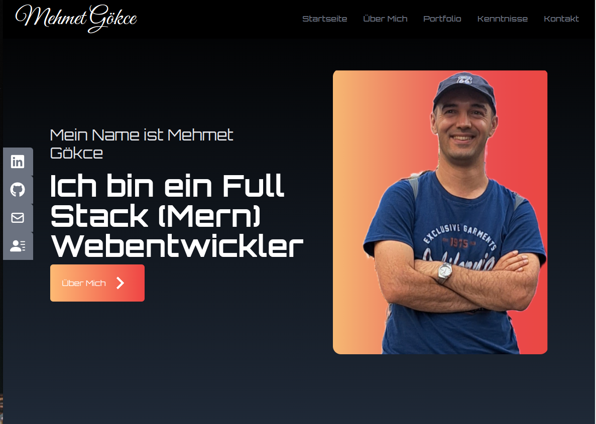

## Mehmet's Portfolio

**[Mehmet's Portfolio](https://mehmetgokce.netlify.app/)**

---

---
### About Project
Willkommen auf meiner Portfolio-Website! Diese Seite dient als zentrale Anlaufstelle, um meine Arbeit, Fähigkeiten und Kontaktinformationen zu präsentieren. Hier ist eine kurze Übersicht über die verschiedenen Bereiche der Website:

### Developed With
#### Frontend
- [x] _React_
- [x] _JavaScript_
- [x] _Tailwind_
- [x] _CSS_

---
### Contact

Mail: mehmetgokce61@gmail.com 
GitHub: https://github.com/Mehmet-Gkc/portfolio 

---
### Used Tools

- [React](https://react.dev/)
- [Tailwind](https://tailwindcss.com/docs/guides/laravel)
- [React-icons](https://react-icons.github.io/react-icons/)
- [npm](https://www.npmjs.com/)
- [Google Fonts](https://fonts.google.com/)
- [Visual Studio Code](https://code.visualstudio.com/)

---

Made with Mehmet Gökce